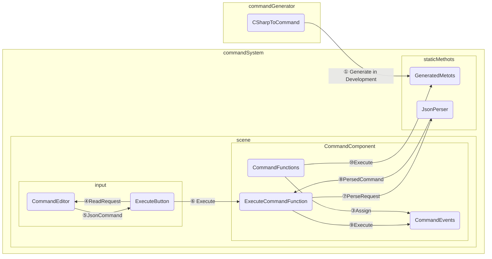

Unity 2022.3.6f1 UniversalRenderPipeline
  minecraftのコマンドライクなインタープリタ言語をUnityC#で実装するプロジェクト。
CSharpInterpriter

# コンセプト

- マインクラフト　ライク　ゲームコマンドでUnityの全機能にアクセスできる"環境"
  > あくまで"ゲーム"でなく"環境"
- 日本の街の中で動ける

# 目標

- Unityランタイム上でインタープリタ言語を弄り、Unityで作れるものは何でも作成可能にする
- 基礎的なFPS操作
- 自由なプリミティブ設置
- コマンドで駆動するクラスの作成機能
- コマンドで駆動する武器の作成機能

## より具体的に…

- Unityのアクセス可能なクラスをマクロでコマンド化
  - TypeName = "Namespace-Class[-NestedClass]"で全ての型に名前を付ける。
  - FunctionName = "TypeName-Function"。すべての関数が名前で区別可能にする。
  - 全てのプロパティはGetter,Setterのいずれかがある関数として扱う
  - cmd : (FunctionName), arg : (Instance[, Argument1][, Argument2]...), return : (Function'sReturn)
  - new は cmd: (TypeName-New), arg : (Instance[, Argument1][, Argument2]...)
  - 
    - 問題：引数に渡す変数の型がわからないのでオーバーロードへの対応はどうする？　数の違いは分かっても型の違いが分からない。
      - "FunctionName[-Arg1Typename][-Arg2Typename][-Arg3Typename]..."
      - オーバーロード関数全てに上記ルールで名前を付ける。
      - エディタを使用するので実際のコマンド名が長ったらしくても問題なーし！
    - 問題：ジェネリック型はどう区別する？　言ってしまえば型の概念が無い。どうする？
      - 引数にて文字列で型を指定する。
      - arg : (Instance [,GenericArgument1][,GenericArgument2]...[,Argument1][,Argument2])で文字列引数にTypeName代入で指定可能にする。C#呼び出し側で型名前とジェネリック引数の対応を定義。
  - Instance : 静的でない関数は全て、まずインスタンスを引数で受け取る。
  - Function'sReturn : コマンドとしてはObject型で返す
  - 

# 仕様

## コマンド部分

基本　エディタでクラスを作成→配置

クラスは配置されて初めて実行されます。

配置されたクラスは、エディタで作成したものの参照です。

クラスが配置情報を引数で受け取ります。

配置後、プリミティブなどと一緒に保存されたクラスは、複製でなくエディタに作成したクラスと必ず紐づきます。

クラスの改変可能な複製は、エディタで複製が必要です。

いまのところ、継承は実装目標ではありません。

## 必要概念

- クラス
  - ユーザーコマンドの纏まりの単位
- プライマー
  - スタート、アップデート、デコンストラクトなどのイベント。
  - エクゼキューションコネクトの開始地点。
  - 武器化する場合は発砲時なども。
- エクゼキューションコネクト
  > 実行接続
  - 順次実行のための接続。一対一
- ユーザーコマンド
  - オリジナルのコマンドを追加する
  - 以下を定義可能
    - コマンド名
    - 引数リスト
    - 処理
    - 出力処理
- 変数
  - 全てSystem.Object型
  - 全てグローバルです
  - コマンドの処理時にキャストされます。
  - コマンドの返り値も、System.Objectで返ります。
    - 変な変換処理をかませない限りデータは維持されます
    - プリミティブは string, float, bool です。
- 条件分岐
  - コマンドの一種。条件に従って実行するコマンドを選択・実行する。
- ループ
  - コマンドの一種。条件に従って実行するコマンドを選択・実行する。
  - 実行後に再度条件を評価。実行するコマンドを選択・実行。
- 引数
  - 全てstring型で渡されます。
  - ユーザーが指定(ハードコーディング)する際、string, float, bool は直接指定できます。
  - 原則、それ以外の型は一度変数に入れます。
    - CatchFromReturnで出力を変数に受け取ります( var "= func()" の部分の役割 )

## 例：インスタンスA内の変数Vとして存在するインスタンスBにアクセスするとき

- 変数Xを作成

CatchFromReturnでユーザ変数Xに代入：インスタンスAを引数にAの型がもつ変数V取得コマンドを実行

- 変数X(いまやインスタンスBが入っている)を引数に、Vの型が持つ各種機能にアクセス

## シーン部分

- 基礎はアセットから持ってきた日本の街
- プレイヤーはプリミティブをスケールしたものをランタイム内で配置可能

## 武器部分

- 武器システムがそのままツールシステム
- 武器の基礎動作
  > デフォルトのイベントと、機能
  - 装備した時
  - プライマリファイア時
  - セカンダリファイア時
  - リロードーキー時
  - 装備外した時
  - 装備切り替えロック
  - プレイヤーの情報が流入
  - シーンの情報が流入
- 武器ツールの動作はGUIに操作を渡すことも可能

## ゲームとしての操作

- FPS視点・操作
- ホイールから武器選択
  - 各種ツールはショートカットキーから装備・プライマリファイア可能
- デフォ武器が各種ツールに対応

## ツール

- インベントリツール
  - 保存したクラスの一覧・管理
  - 武器の管理
- クラス配置ツール
  - インベントリから選択されたクラスの配置
- プリミティブ配置ツール
  - プリミティブの配置
- 選択ツール
  - クラス・プリミティブの選択
- トランスフォームツール
- 保存ツール
  - 選択の保存・クラス変換
- 物理設定ツール
  - 選択の物理のオンオフ
  - 完全固定設定も可能
- 接着ツール
  - 選択のフィックスコンストレイント設定
- 削除ツール
  - 選択の削除

## GUI

- インベントリ
  - クラス管理
    - 保存したプリミティブもあくまでクラスです
  - 武器管理
- クラスエディタ
  - プライマリページ
  - ファンクションページ

## 機能

- クラスの編集
- クラスの保存
- クラスの読込
- クラスのシーンへの登録
- プリミティブ、クラス群(GameObject群)の、ユーザーファンクション化
  - 構築されたプリミティブ群を、Instanciate、Translateなどの手順としての保存・コマンド化
- シーンの保存
- シーンの読込
- プロジェクトの保存
- プロジェクトの読込

